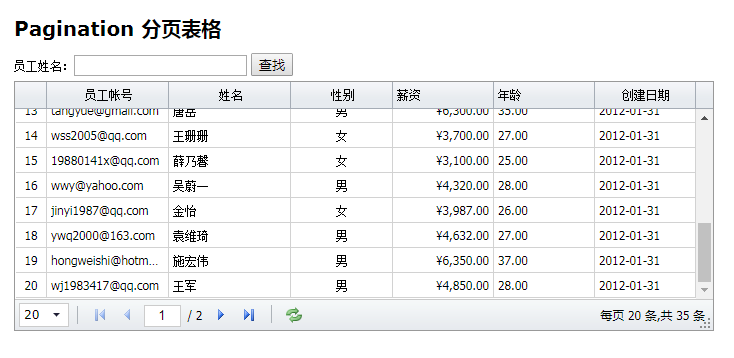
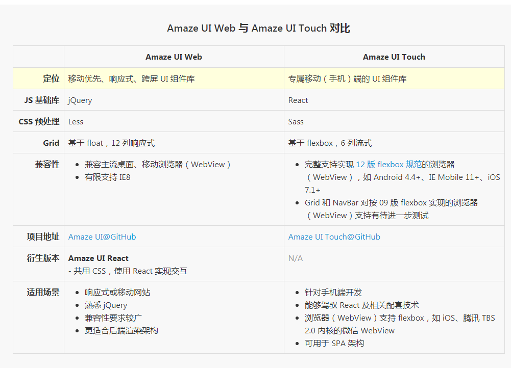
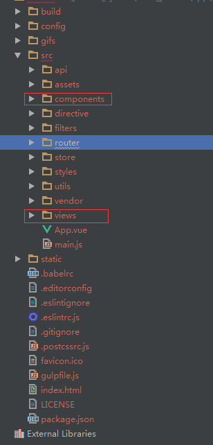

### 一、后台系统前端框架选择
##### （1）当我们在做后台系统时，经常要面对如何去选择一个前端模板。一般来讲后台系统有以下特点。
1. 表格多，而且表格需要根据所选列进行动态选择导表。
2. 交互多，与传统的展示一个静态网页不同，复杂的后台系统交互非常繁杂，除了查询、编辑，还有各种跳转。
3. 权限管理，后台系统需要分别对于各种账号进行权限管理，不同账号不同菜单，如果细分权限还要对于不同接口细分。

##### （2）我们的选择。
1. FlatLab + Python Django

[FlatLab展示](http://thevectorlab.net/flatlab/)
[bootstrap3模版flatlab3.3.2 完整版下载](http://download.csdn.net/download/zengyi083011/8447049)
我们来看一段，前端后端交互的代码，上面部分是渲染生成一个table的分页，下面部分是python代码告知前端，我给前端的数据。
从下面代码我们可以知道，前端要根据后端传过来的数据，进行一定的运算后，才能分页。前端没有做到真正的组件化。
```vbscript-html
	<div>
        <ul class="pagination pagination-sm pull-right">
             
            <li><a href="javascript:;" onclick="history_part('{{pagedata_his.number-1}}')" id="his_before"><<</a></li> 
                
                <li><a href="javascript:;" onclick="history_part('{{page_num}}')"> 
                     
                    <font color="red">{{page_num}}</font> 
                     
                        {{page_num}} 
                    
                </a></li> 
             
            <li><a href="javascript:;" onclick="history_part('{{pagedata_his.number+1}}')" id="his_next">>></a></li> 
            
        </ul>
    </div>
```
``` python
return render_to_response("history_data.html",{
                            "history":history,
                            "pagedata_his":pagedata_his,
                            "pagenum_his":pagenum_his,})
```
> python django前端渲染的引擎有自带的，也可以使用jinjia2。

2. Jquery EasyUI + PHP Smarty

[Jquery EasyUI官网](http://www.jeasyui.net/)
[Jquery EasyUI数据表格例子](http://www.jeasyui.net/demo/331.html)
[smarty模板使用及其原理](http://www.yiibai.com/smarty/smarty_install.html)
我们可以自己写一个LibTemplate类文件来封装对于smarty的使用，然后在我们的php框架中调用即可。
服务器端的代码这里就不一一列举了。本质上与django\flask 中使用jinjia2引擎渲染，没有本质区别。


> 那上面这种前前后端耦合，有哪些特点呢。
> 1. 如果只是增加一个类似的分页，非常方便，因为只需要后端增加一个模板页面，即可。
> 2. 但是，如果是前端要新加效果，改动非常大。拿下面表格举例，我想要在姓名一列加上一个功能，如果双击某个名字，这个名字可以自动填充到查询的输入框。比如双击王珊珊，查询的输入框就自动输入王珊珊。对于高度耦合的前端改动很大，而且有可能牵一发而动全身，除非一开始你就规划好，要不然后来添加要改动的地方都比较多。



3. Amaze UI。

[Amaze UI官网](http://amazeui.org/)
[Amaze 后台模板](http://amazeui.org/examples/admin-table.html)
> 1. 官网对于Amaze UI特点的归纳，如下图表格所示。
> 2. 我认为，它还有个特点就是模板非常丰富。有专门的模板中心，提供你选择。[模板中心](http://tpl.amazeui.org/)
> 3. 而且它有个衍生的版本Amaze UI React。这里有一篇文章介绍React与Vue的优劣。[React 还是 Vue: 你应该选择哪一个Web前端框架？](http://www.cnblogs.com/Chen-XiaoJun/p/6246946.html)
> 

4. iView
[iView组件官网](https://www.iviewui.com/docs/guide/install)
[基于iView后台管理简单模板](https://juejin.im/entry/5902bf69b123db3ee46b510d)
> iView与后面的element有很多相似之处。他们之间也闹出过不愉快。从技术本质上讲，基本没啥区别。
> 有的人喜欢iView的风格，有的人喜欢element的风格。相对来讲，element出来更早，团队维护，更加成熟。

5. element + vue + axios。

[element官网](http://element.eleme.io/#/zh-CN/component/installation)
[vue2.0官网](https://www.vuefe.cn/v2/guide/)
[vuex官网](https://vuex.vuejs.org/zh-cn/)
[axios攻略](https://ykloveyxk.github.io/2017/02/25/axios%E5%85%A8%E6%94%BB%E7%95%A5/)
> 我为什么选择element？
> 1. 由饿了么专业团队维护，每2周更新一次。
> 2. 组件非常丰富，按需接入。
> 3. 与vue结合，开发效率更高。

> 为啥选择axios？具体可以参考[JS HTTP库/Ajax库](http://blog.ipsfan.com/2950.html)
> 1. 支持nodejs，也就是说支持在服务端使用。传统的$.ajax只支持浏览器。
> 2. Axios 基于 promise 语法标准。[什么是 Promise](http://wiki.jikexueyuan.com/project/javascript-promise-mini-book/what-is-the-promise.html)如何使用promise语法可以参考[JavaScript Promise迷你书（中文版）](http://liubin.org/promises-book/)
> 3. 小巧，灵活。


##### （3）element + vue + axios的详细介绍。
1. 可以参考的模板一：[hotpot-admin](http://hotpot.kevin70.com/c/forms/basic-form)、[GitHub 地址](https://github.com/kevin70/hotpot-admin)
2. 可以参考的模板二：[SlsAdmin](https://doc.vue.slsadmin.org/)
3. 我是用的模板：[vue-element-admin的github地址](https://github.com/PanJiaChen/vue-element-admin)、[示例地址](http://panjiachen.github.io/vue-element-admin/#/dashboard)

> 该模板的特点
> 1. 丰富的编辑框，有富文本编辑器、MarkDown编辑器、Json编辑器；
> 2. 分页展示，非常友好；
> 3. 根据接口获取的权限结果，动态载入菜单；

> 开发步骤 
> 1. 下载所有的模板文件，本地启动。
> 2. 如下图所示，是下载下来的模板文件的目录结构。可以先做减法，将views中你不需要的vue文件全部删除。将components中你没有引入的组件也删除了。删除的时候要注意删除一个文件夹并本地测试下，避免删除主vue（引导栏的vue）。
> 3. 删除不必要的组件后，就可以开始开发了，开发时，可以根据你的需要再去引入相关的组件。如果是这个模板里的组件，就引用模板里的组件。多数情况下，我们只需要引入[element官网](http://element.eleme.io/#/zh-CN/component/installation)的组件。
> 

> 开发中遇到的问题。参考[element、vue2.0+、vuex、axios开发中遇到的坑点](http://blog.csdn.net/hustxiaoxian/article/details/76092336)
> 1. 本地调试时的跨域问题的解决。
> 2. axios.get、axios.post传输到后端的数据，后端接收不到。

