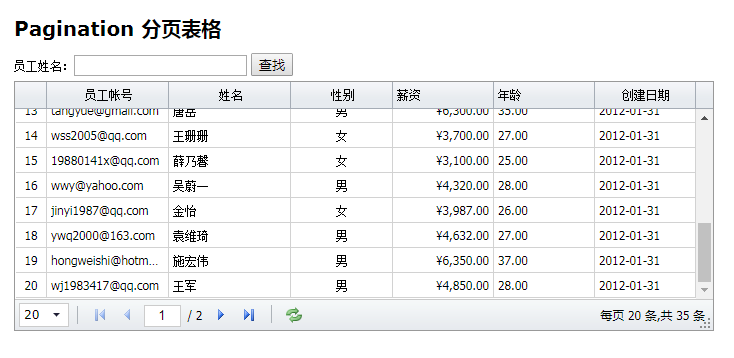

### 一、后台系统前端框架选择
##### （1）当我们在做后台系统时，经常要面对如何去选择一个前端模板。一般来讲后台系统有以下特点。
1. 表格多，而且表格需要根据所选列进行动态选择导表。
2. 交互多，与传统的展示一个静态网页不同，复杂的后台系统交互非常繁杂，除了查询、编辑，还有各种跳转。
3. 权限管理，后台系统需要分别对于各种账号进行权限管理，不同账号不同菜单，如果细分权限还要对于不同接口细分。

##### （2）以往的我们有啥选择。
1. FlatLab + Python Django
[FlatLab展示](http://thevectorlab.net/flatlab/)
[bootstrap3模版flatlab3.3.2 完整版下载](http://download.csdn.net/download/zengyi083011/8447049)
我们来看一段，前端后端交互的代码，上面部分是渲染生成一个table的分页，下面部分是python代码告知前端，我给前端的数据。
从下面代码我们可以知道，前端要根据后端传过来的数据，进行一定的运算后，才能分页。前端没有做到真正的组件化。
```vbscript-html
	<div>
        <ul class="pagination pagination-sm pull-right">
             
            <li><a href="javascript:;" onclick="history_part('{{pagedata_his.number-1}}')" id="his_before"><<</a></li> 
                
                <li><a href="javascript:;" onclick="history_part('{{page_num}}')"> 
                     
                    <font color="red">{{page_num}}</font> 
                     
                        {{page_num}} 
                    
                </a></li> 
             
            <li><a href="javascript:;" onclick="history_part('{{pagedata_his.number+1}}')" id="his_next">>></a></li> 
            
        </ul>
    </div>
```
``` python
return render_to_response("history_data.html",{
                            "history":history,
                            "pagedata_his":pagedata_his,
                            "pagenum_his":pagenum_his,})
```
> python django前端渲染的引擎有自带的，也可以使用jinjia2。

2. Jquery EasyUI + PHP Smarty
[Jquery EasyUI官网](http://www.jeasyui.net/)
[Jquery EasyUI数据表格例子](http://www.jeasyui.net/demo/331.html)
[smarty模板使用及其原理](http://www.yiibai.com/smarty/smarty_install.html)
我们可以自己写一个LibTemplate类文件来封装对于smarty的使用，然后在我们的php框架中调用即可。
服务器端的代码这里就不一一列举了。本质上与django\flask 中使用jinjia2引擎渲染，没有本质区别。


> 那上面这种前前后端耦合，有哪些特点呢。
> 1. 如果只是增加一个类似的分页，非常方便，因为只需要后端增加一个模板页面，即可。
> 2. 但是，如果是前端要新加效果，改动非常大。拿下面表格举例，我想要在姓名一列加上一个功能，如果双击某个名字，这个名字可以自动填充到查询的输入框。比如双击王珊珊，查询的输入框就自动输入王珊珊。对于高度耦合的前端改动很大，而且有可能牵一发而动全身，除非一开始你就规划好，要不然后来添加要改动的地方都比较多。



3. 